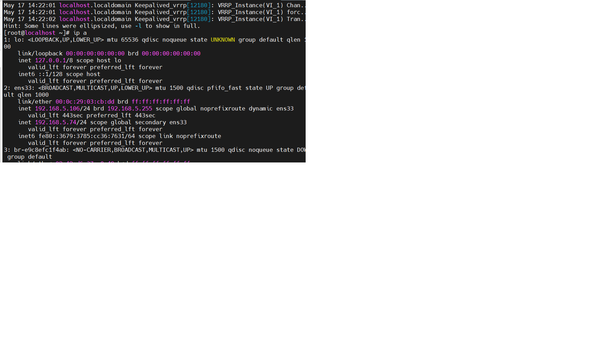

# hướng dan triển khai keepalived cho apache
- Tổng quan: HAPRoxy là viết tắt của High Availability Proxy là  công cụ nổi tiếng ứng dụng cho giải pháp cân bằng tải TCP/HTTP cũng như giải pháp máy chủ Proxy (Proxy Server). HAProxy có thể chạy trên các  môi trường như Linux,Solars. Công dụng phổ biến nhất của Haproxy là cải thiện hiệu năng, tăng độ tin cậy của hệ thống máy chủ bằng cách phân phối khối lượng công việc trên nhiều máy chủ (như web, app, cơ sở dữ liệu). Haproxy hiện đã và đang được sử dụng bởi nhiều website như twitter, gihub...
- dịch vụ keepalived sử dụng với mục đích tạo ra virtual ip address(IP VIP) cho hệ thống. Tiến trình keepalived có thể tự động giám sát dịch vụ hoặc hệ thống và có khả năng chịu lỗi cho hệ thống khi dịch vụ hoặc hệ điều hành xảy ra vấn đề.

---
# chuẩn bị
Node1: 192.168.5.106
Node2: 192.168.5.72
Node3: 192.168.5.73
# cấu hình apache
**trên node 1**
- yum install httpd -y
- systemctl start httpd
- systemctl enable httpd
- echo '<h1>Chào mừng tới Blog Cloud365 (Web1)</h1>' > /var/www/html/index.html
- truy cập vào path: 'nano /etc/httpd/conf/httpd.conf' rồi sử Listen 80 thành Listen 192.168.5.106
- rồi start lại dịch vụ: 'systemctl restart httpd'
**Trên node 2** làm tương tự nhưng thay địa chỉ ip
yum install httpd -y
cat /etc/httpd/conf/httpd.conf | grep 'Listen 80'
sed -i "s/Listen 80/Listen 192.168.5.72:80/g" /etc/httpd/conf/httpd.conf

echo '<h1>Chào mừng tới Blog Cloud365 (Web2)</h1>' > /var/www/html/index.html
systemctl start httpd
systemctl enable httpd
** Trên node 3** 
yum install httpd -y
cat /etc/httpd/conf/httpd.conf | grep 'Listen 80'
sed -i "s/Listen 80/Listen 192.168.5.73/g" /etc/httpd/conf/httpd.conf

echo '<h1>Chào mừng tới Blog Cloud365 (Web3)</h1>' > /var/www/html/index.html
systemctl start httpd
systemctl enable httpd


# Triển khai keepalived
## cài đặt gói keepalived trên cả 3 node
'yum install keepalived -y'
### giải thích các tham số tron keepalive.config
- trong bài chúng ta sẽ sử dụng keepalived để kiểm tra trạng thái của Haproxy mỗi 2 giấy, nếu kiểm tra thành công node sẽ được cộng 2 điểm:
```
vrrp_script chk_haproxy {
    script "killall -0 haproxy" #check the haproxy process
    interval 2 # every 2 seconds
    weight 2 # add 2 points if OK
}
```
- tiếp theo chúng ta sẽ tạo block với tên vrrp_instance. đay là thành phần chính khi cấu hình haproxy . giao diện mạng là interface ens33. mô hình keepalived là master-slave. node 1 làm master với tham số state bằng MASTER và node 2 và 3 làm slave với tham số state bằng BACKUP.  
```
# Trên Node1
vrrp_instance VI_1 {
    interface ens160
    state MASTER
    ..
}

# Trên Node2
vrrp_instance VI_1 {
    interface ens160
    state BACKUP
    ..
}

# Trên Node3
vrrp_instance VI_1 {
    interface ens160
    state BACKUP
    ..
}
```
với giá trị ưu tiên priority là 101 ở node 1, 100 ở node2, 99 ở node3.
```
# Trên Node1
vrrp_instance VI_1 {
    ..
    priority 101
    ..
}

# Trên Node2
vrrp_instance VI_1 {
    ..
    priority 100
    ..
}

# Trên Node3
vrrp_instance VI_1 {
    ..
    priority 99
    ..
}
```
Cụm cần chỉ định một id để chia sẻ giữa các node với tham số là virtual_route_id. ở đây mình sử dụng 51
 ```
 vrrp_instance VI_1 {
    ..
    virtual_router_id 51
    ..
}
```
Khai báo IP VIP cho cụm 3 node sử dụng block virtual_ipaddress.
```
vrrp_instance VI_1 {
    ..
    virtual_ipaddress {
        10.10.10.89/24 # virtual ip address 
    }
    ..
}
``` 
Cuối cùng là track_script. track_scrip giúp keepalived xác định node nào sẽ nắm giữ VIP. Như trong bài node1 được cấu hình với độ ưu tiên bằng 101. Nếu node1 kiểm tra dịch vụ haproxy thành công thì độ ưu tiên của nó sẽ không đổi nhưng nếu kiểm tra thất bại thì độ ưu tiên của nó sẽ giảm đi 2 và thấp hơn node2 và khi ddos node2 sẽ được chuyển IP VIP sang. đó là cách dịch vụ keepalived hoạt động.

### cầu hình full cho keepalives.conf 
- trên node 1
```
echo '
vrrp_script chk_haproxy {
    script "killall -0 haproxy"
    interval 2
    weight 2
}
vrrp_instance VI_1 {
    interface ens33
    state MASTER
    virtual_router_id 51
    priority 101
    virtual_ipaddress {
        192.168.5.75/24
    }
    track_script {
        chk_haproxy
    }
}' > /etc/keepalived/keepalived.conf
```
- trên node 2
```
echo '
vrrp_script chk_haproxy {
    script "killall -0 haproxy"
    interval 2
    weight 2
}
vrrp_instance VI_1 {
    interface ens33
    state BACKUP
    virtual_router_id 51
    priority 100
    virtual_ipaddress {
        192.168.5.75/24
    }
    track_script {
        chk_haproxy
    }
}' > /etc/keepalived/keepalived.conf
```
- trên node 3
```
echo '
vrrp_script chk_haproxy {
    script "killall -0 haproxy"
    interval 2
    weight 2
}
vrrp_instance VI_1 {
    interface ens33
    state BACKUP
    virtual_router_id 51
    priority 99
    virtual_ipaddress {
        192.168.5.75/24
    }
    track_script {
        chk_haproxy
    }
}' > /etc/keepalived/keepalived.conf
```

# khởi động lại dịch vụ keepalive trên cả 3 node
```
systemctl start keepalived
```
# ta kiểm tra ip trên node 1
câu lệnh: `ip a` sẽ thấy thêm ip của cluster

## kiểm tra hoạt động bằng cách stop cái node1 đi thì sẽ thấy ip vip chuyển sang node 2
# có thể xem log bằng cách:
```
tail -n 100 /var/log/messages
```
